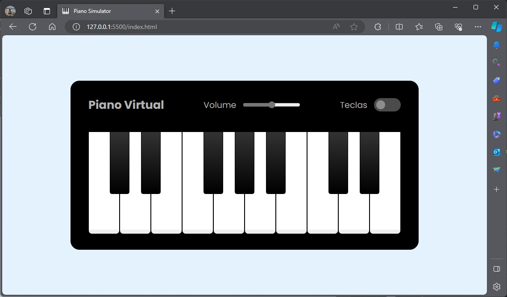

# DIO - Desafio de Projeto: Construindo um Simulador de Piano com JavaScript

Neste projeto foi feito um piano digital utilizando HTML, CSS e JavaScript para o Bootcamp Potência Tech iFood - Desenvolvimento de Jogos da Dio.

